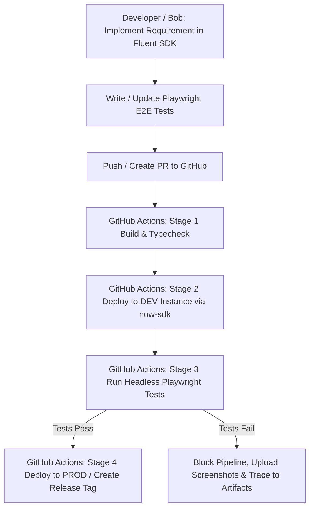

# ServiceNow Fluent SDK + Playwright E2E Test & DevOps Framework

Unified ServiceNow engineering framework combining **ServiceNow Fluent SDK (TypeScript/Metadata as Code)** and **Playwright automated browser testing** orchestrated by **GitHub Actions CI/CD**.

---

## 🏗️ Architecture & Workflow



---

## 📁 Repository Structure

```text
FluentAndPlayWright/
├── .github/
│   └── workflows/
│       ├── fluent-playwright-pipeline.yml  # Build -> Deploy DEV -> Run Playwright -> Deploy PROD
│       └── pr-checks.yml                  # PR quality & compilation validation
├── src/
│   ├── fluent/
│   │   └── app.now.ts                      # Fluent SDK Tables, Business Rules, Client Scripts, Script Includes
│   └── server/
│       ├── businessRuleScripts.js         # Server-side Business Rule logic
│       └── FluentPlayUtils.server.js      # Server Script Include logic
├── tests/
│   └── fluent-app.spec.ts                 # Playwright test specs matching Fluent requirements
├── utils/
│   ├── base-page.ts                       # Base Page Object with ServiceNow Frame / Shadow DOM helpers
│   └── fluent-task-page.ts                # Page Object Model for custom Fluent task application
├── global-setup.ts                        # ServiceNow login & storageState.json session generator
├── playwright.config.ts                   # Playwright configuration tuned for ServiceNow
├── now.config.json                        # ServiceNow Scope & Application configuration
├── tsconfig.json                          # TypeScript compiler settings
├── package.json                           # Dependencies & lifecycle scripts
└── .env.example                           # Sample environment configuration
```

---

## 🚀 Getting Started

### 1. Prerequisites
- Node.js `18.x` or `20.x`
- ServiceNow CLI (`@servicenow/sdk`)
- A ServiceNow Instance (PDI or Enterprise sub-prod)

### 2. Setup Local Environment
```bash
# 1. Install dependencies
npm install

# 2. Copy environment template
cp .env.example .env
# Fill in your ServiceNow instance URL, username, and password in .env

# 3. Authenticate now-sdk
npx now-sdk auth --add "https://your-instance.service-now.com" --type basic --alias dev --username "admin"
```

### 3. Local Development Commands
```bash
# Build ServiceNow Fluent metadata
npm run build

# Deploy metadata to ServiceNow instance
npm run deploy -- --auth dev

# Run Playwright E2E test suite in headless mode
npm run test

# Run Playwright in headed mode with UI debugger
npm run test:headed
npm run test:ui
```

---

## 🔐 GitHub Secrets Configuration

To run the automated GitHub Actions pipeline, configure the following secrets in **GitHub Repository -> Settings -> Secrets and variables -> Actions**:

| Secret Name | Description | Example |
|-------------|-------------|---------|
| `SN_DEV_INSTANCE` | DEV ServiceNow Instance Base URL | `https://dev12345.service-now.com` |
| `SN_DEV_USER` | DEV ServiceNow Admin/Dev Username | `admin` |
| `SN_DEV_PASS` | DEV ServiceNow Password | `••••••••` |
| `SN_PROD_INSTANCE` | PROD ServiceNow Instance Base URL | `https://prod.service-now.com` |
| `SN_PROD_USER` | PROD ServiceNow Admin Username | `admin` |
| `SN_PROD_PASS` | PROD ServiceNow Password | `••••••••` |

---

## 🤖 Bob Requirement Implementation Lifecycle

Whenever you assign a requirement to **Bob**:
1. **Develop**: Bob generates Fluent metadata in [`src/fluent/app.now.ts`](src/fluent/app.now.ts:1) and server scripts in [`src/server/`](src/server/businessRuleScripts.js:1).
2. **Test Spec**: Bob authors corresponding automated Playwright test cases in [`tests/fluent-app.spec.ts`](tests/fluent-app.spec.ts:1) utilizing [`utils/fluent-task-page.ts`](utils/fluent-task-page.ts:1).
3. **Commit & Push**: Triggering the unified GitHub Actions CI/CD pipeline.
4. **Automated Verification**: The pipeline builds the Fluent package, deploys it to the DEV instance, logs in with Playwright, runs all UI/BR assertions, and upon green tests, initiates promotion to PROD.
